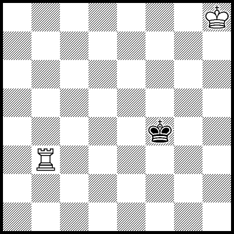

# ♟️ Rook vs King Endgame Agent

This project explores the **rook vs king chess endgame** using a combination of **Monte Carlo Tree Search (MCTS)** and a **Neural Network** (DQN-style). The goal is to train an agent that can consistently checkmate the lone king with a rook and king.  

<p align="center">
  
</p>

---

## 🚀 Features
- Custom **RookKingEnv** simulating the rook vs king endgame.  
- **MCTSAgent** for decision-making guided by a neural network.  
- Uses **TensorFlow** for training the value/policy network.  
- **ChessRenderer** for board visualization.  
- Automatic **checkpoint saving/loading** of models and move mappings.  
- GPU support if available.  

---

## 📂 Project Structure
```
.
├── train.py                # Main training script (your file)
├── environment.py          # RookKingEnv (custom chess environment)
├── mcts.py                 # MCTSAgent (MCTS + NN)
├── chess_renderer.py       # Board rendering logic
├── move_mapping.json       # Move-to-index mapping
├── dqn_model_checkpoint.weights.h5  # Model weights (saved after training)
└── README.md               # This file
```

---

## 🛠️ Installation
Clone the repository and install dependencies:
```bash
git clone https://github.com/JamalEddineEb/deep-q-learning-for-chess.git
cd rook-king-mcts
pip install -r requirements.txt
```

Requirements include:
- Python 3.8+  
- TensorFlow  
- numpy  
- memory-profiler  

---

## ▶️ Usage
Start training the agent:
```bash
python train.py
```

During training:  
- Model checkpoints are saved after each episode (default: `dqn_model_checkpoint.weights.h5`).  
- The agent improves its play over multiple episodes.  

---

## 📊 Example Output
```
Num GPUs Available:  1
Loading model from dqn_model_checkpoint.weights.h5
episode 0
1 moves made
2 moves made
Episode: 0/500, Score: 1, epsilon: 0.95
mates : 0 / 1
saved
```

---

## 📈 Roadmap
- [ ] Improve MCTS simulations for deeper lookahead.  
- [ ] Support for more endgame scenarios (e.g., Queen vs King).  
- [ ] Web-based visualization of training progress.  


